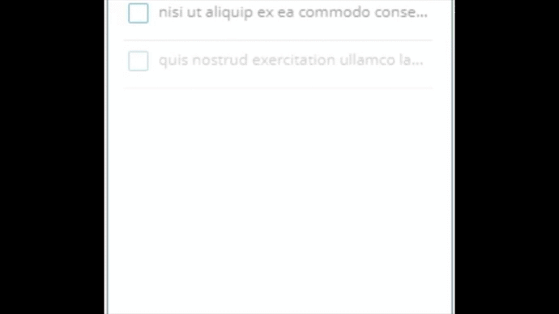

# Angular Animations Examples

## *ngFor
```javascript
trigger('matListAnim', [
      transition('* <=> *', [
        query('mat-list-item:enter',
          [
            style({ opacity: 0, transform: 'translateY(-15px)' }),
            stagger(
              '100ms',
              animate(
                '500ms ease-out',
                style({ opacity: 1, transform: 'translateY(0px)' })
              )
            )
          ],
          {optional: true}
        )
      ])
    ])
```
<center></center>
<center></center>
